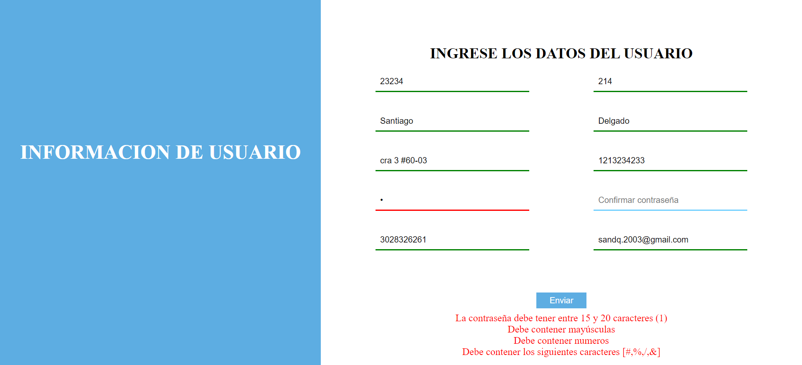
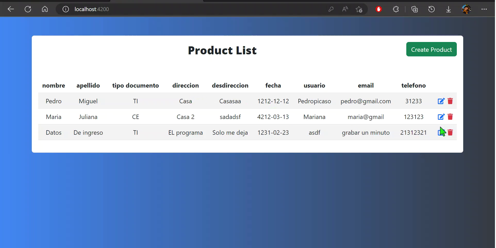
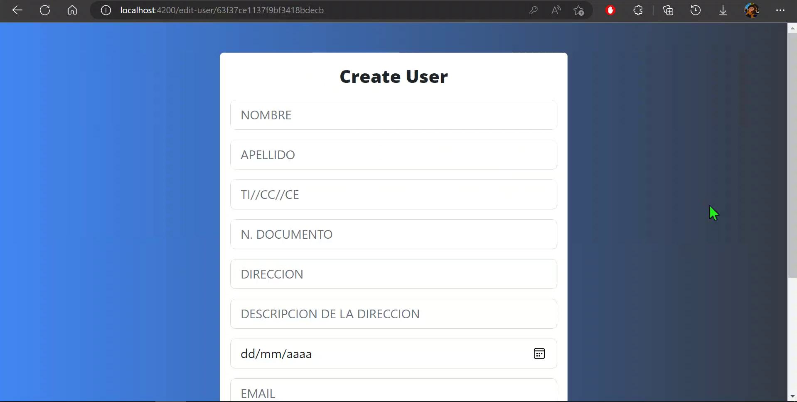
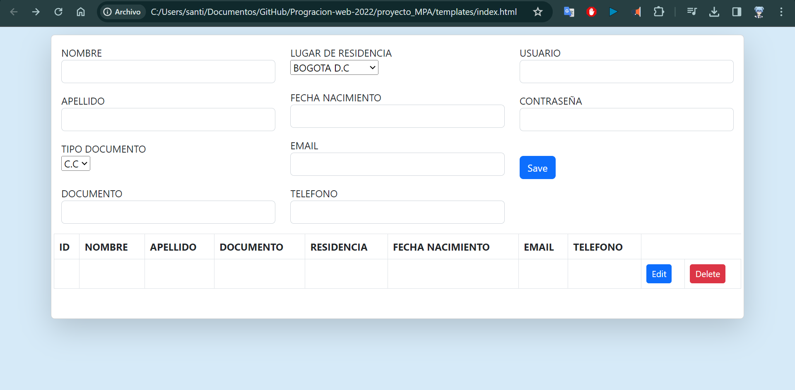

# Proyectos de Programación Web

Este repositorio contiene una serie de proyectos desarrollados como parte de mi curso de programación web. Cada proyecto representa un hito en mi aprendizaje y práctica de tecnologías clave en el desarrollo web.

Contenido del Repositorio:
**Taller 2:** Conjunto de páginas web básicas que sirven como introducción al desarrollo web. Aunque carece de estilos CSS sofisticados, incluye elementos esenciales de programación web.

**Taller 3:** En este taller, he implementado una página de inicio de sesión con un estilo CSS básico y un script sencillo para la validación de datos de usuario.

**Taller 4:** Avanzando en las capacidades de desarrollo, este taller presenta una página de inicio de sesión más refinada con estilos CSS avanzados y un script más robusto para la gestión de usuarios.

**Proyecto_SPA:** Una aplicación de página única (Single Page Application) que utiliza Bootstrap para el diseño y ofrece funcionalidades avanzadas como visualización, filtrado y consulta de datos desde una base de datos local en PostgreSQL.

**Proyecto_MPA:** Aplicación de múltiples páginas conectadas entre sí (Multi-Page Application) para brindar una experiencia más tradicional.
